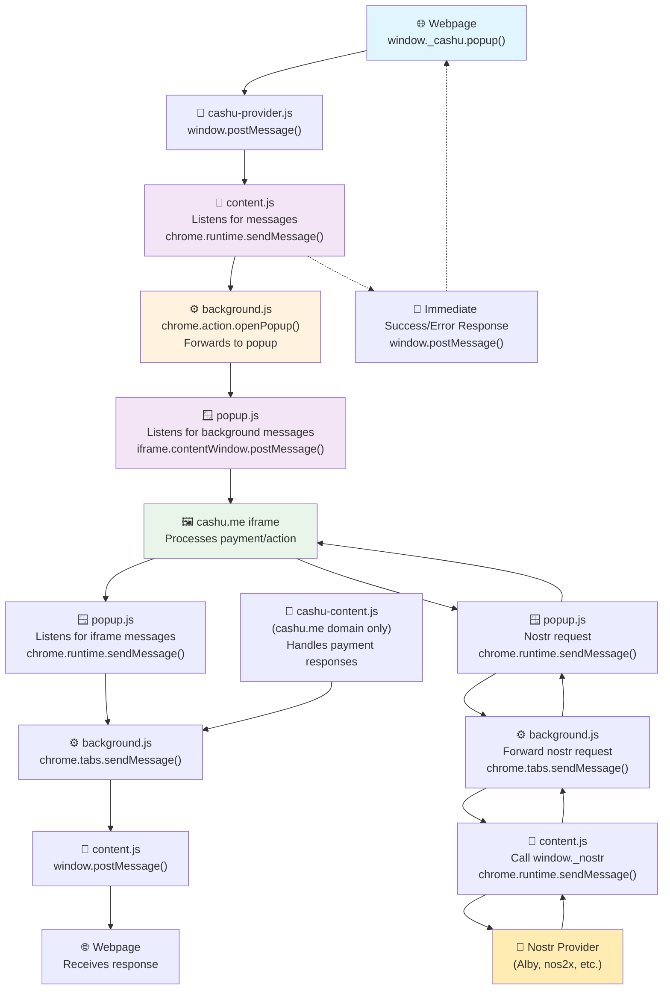

Disclaimer: I vibe coded this.


https://github.com/user-attachments/assets/2cbef35e-0873-4911-af17-24a70e55c1d2


# About

This is mainly a proof of concept of how a Cashu.me wallet extension that I vibe coded. This would likely require some security consideration before getting merged into Cashu.me. If any experts on browser security with regard to browser extensions, iframes and post messages then your feedback is super appreciated.

Ideally this extension shouldn't need much updates after we have it working, it uses an iframe for Cashu.me.

# Message Flow Architecture

This extension uses a complex message passing system to communicate between the webpage context, extension content scripts, background script, and the popup iframe. Here's a detailed breakdown of the flow:

## Components Overview

1. **cashu-provider.js** - Injected into webpage context, provides `window._cashu` API
2. **content.js** - Content script that bridges webpage and extension
3. **cashu-content.js** - Specialized content script for cashu.me domain
4. **background.js** - Service worker handling extension logic
5. **popup.js** - Popup script managing the cashu.me iframe
6. **popup.html** - Contains iframe loading cashu.me

## Forward Message Flow (Webpage → Popup)

### 1. Webpage Initiates Action
```javascript
// User calls API on webpage
window._cashu.popup({ action: 'lnpay', params: { addrOrLnurl, amount, comment } });
```

**File: cashu-provider.js (Lines 18-40)**
- Creates message object with `ext: 'cashu'`, `type: 'openPopup'`, action, and params
- Posts message to same window using `window.postMessage()`

### 2. Content Script Receives Message
**File: content.js (Lines 14-60)**
- Listens for `message` events on window
- Filters for messages with `ext: 'cashu'` and `type: 'openPopup'`
- Forwards to background script via `chrome.runtime.sendMessage()`

Message structure:
```javascript
{
  action: 'openPopup',
  type: message.data.action,  // e.g., 'lnpay'
  params: message.data.params || {}
}
```

### 3. Background Script Processes Request
**File: background.js (Lines 5-22)**
- Receives message with `action: 'openPopup'`
- Opens popup using `chrome.action.openPopup()`
- After 2-second delay, forwards action to popup:

```javascript
chrome.runtime.sendMessage({
  action: message.type,  // e.g., 'lnpay'
  params: message.params
});
```

### 4. Popup Receives and Forwards to Iframe
**File: popup.js (Lines 24-51)**
- Listens for messages from background script
- Gets reference to cashu.me iframe
- Posts message to iframe:

```javascript
iframe.contentWindow.postMessage({
  ext: "cashu",
  type: message.action,  // e.g., 'lnpay'
  params: message.params,
  id: Date.now()
}, "*");
```

### 5. Cashu.me Iframe Processes Request
The iframe (cashu.me) receives the message and can process the payment request, token claim, etc.

## Backward Message Flow (Popup → Webpage)

### 1. Cashu.me Iframe Sends Response
The cashu.me iframe can send responses or events back:

```javascript
// From iframe
window.parent.postMessage({
  ext: "cashu",
  type: "frontendEvent",
  event: "paymentComplete",
  message: "Payment successful",
  payload: { /* payment details */ }
}, "*");
```

### 2. Popup Forwards to Background
**File: popup.js (Lines 5-22)**
- Listens for messages from iframe
- Forwards frontend events to background:

```javascript
chrome.runtime.sendMessage({
  action: "frontendEvent",
  event: data.event,
  message: data.message,
  payload: data.payload,
  id: data.id
});
```

### 3. Background Forwards to Content Script
**File: background.js (Lines 24-40)**
- Receives `frontendEvent` messages
- Queries active tab and forwards message:

```javascript
chrome.tabs.sendMessage(tabs[0].id, {
  action: 'frontendEvent',
  event: message.event,
  message: message.message,
  payload: message.payload,
  id: message.id
});
```

### 4. Content Script Forwards to Webpage
**File: content.js (Lines 62-76)**
- Receives messages from background
- Posts message back to webpage:

```javascript
window.postMessage({
  id: message.id,
  ext: 'cashu',
  type: 'frontendEvent',
  event: message.event,
  message: message.message,
  payload: message.payload
}, targetOrigin);
```

### 5. Webpage Receives Response
The original webpage can listen for these responses to handle completion events, errors, etc.

## Special Cases

### Success/Error Responses
**File: content.js (Lines 41-58)**
After forwarding to background, content script immediately sends success/error response:

```javascript
window.postMessage({
  id: message.data.id,
  ext: 'cashu',
  response: { success: true }  // or { error: error.message }
}, targetOrigin);
```

### Iframe Lightning Payments
**File: content.js (Lines 87-125)**
Handles special case for iframe-based lightning payments with direct iframe communication.

### Cashu.me Domain Specific
**File: cashu-content.js**
- Runs only on cashu.me domain
- Handles payment responses and forwards them to background for logging

## Security Considerations

1. **Origin Validation**: Uses `getTargetOrigin()` helper to validate message origins
2. **Message Filtering**: All scripts filter messages by `ext: 'cashu'` identifier
3. **Same-Window Validation**: Content scripts verify `message.source === window`
4. **Iframe Source Validation**: Popup validates messages come from the cashu.me iframe

## Message Types

- `openPopup` - Request to open popup with specific action
- `frontendEvent` - Generic events from cashu.me back to webpage
- `lightningPayment` - Special handling for iframe lightning payments
- `paymentResponse` - Responses to payment requests

This architecture enables secure, bidirectional communication while maintaining proper isolation between webpage context, extension context, and iframe context.

## Nostr Integration

The extension now supports forwarding Nostr API calls from the cashu.me iframe to Nostr providers (like Alby, nos2x, etc.) installed on the user's browser.

### How Nostr Integration Works

1. **Cashu.me iframe** sends nostr request via `postMessage` to popup
2. **popup.js** forwards request to background script  
3. **background.js** forwards request to content script on active tab
4. **content.js** calls `window._nostr` method on the webpage (where Nostr extension is available)
5. **Response flows back through the same chain to cashu.me iframe**

### Supported Nostr Methods

- `getPublicKey()` - Get user's public key
- `signEvent(event)` - Sign a Nostr event  
- `getRelays()` - Get user's relay list
- `nip04.encrypt(pubkey, plaintext)` - Encrypt message using NIP-04
- `nip04.decrypt(pubkey, ciphertext)` - Decrypt message using NIP-04

### Usage in Cashu.me

The cashu.me iframe receives a `nostrAvailable` message when the extension loads, then can make requests like:

```javascript
// Send nostr request from cashu.me iframe
window.parent.postMessage({
    ext: 'cashu',
    type: 'nostrRequest', 
    method: 'getPublicKey',
    params: {},
    id: Date.now()
}, '*');
```

See [nostr-integration-example.md](nostr-integration-example.md) for complete usage examples and implementation details.

## Visual Flow Diagram



**Legend:**
- 🌐 Webpage Context
- 📄 Injected Provider Script  
- 📜 Content Scripts
- ⚙️ Background Script (Service Worker)
- 🪟 Popup Context
- 🖼️ Iframe Context
- 🔑 Nostr Provider (External Extension)
- Solid arrows: Main message flow
- Dotted arrows: Immediate responses

# Getting Started
```
npm install
rm -rf .parcel-cache distribution # I've found that its often necessary to run this otherwise the caching is sometimes weird.
npm run watch
npm install --global web-ext # (only only for the first time)
web-ext run -t chromium

git clone https://github.com/kelbie/cashu.me 
npm install
npm run dev
```

In browser open up `https://localhost:8080`. You need to do this otherwise theres some security warning in the popup because of `https`.

After chrome opens up click "Claim Token", these are feeless cashu tokens that are automatically created so you can have a balance in Cashu.me. 

# TODO

- I think there may be an extra step or two when sending the messages from the website -> cashu.me.
- We will need to request specific permissions to make some functionality work like camera, copy, etc.
- Firefox extension iframe feels buggy compares to chrome, mainly onhover styles being applied weirdly and elements vanishing for no reason.
- Create a super simple publish script which generates all the folders and zips them up in the way Firefox, Chrome, etc. expect them and include links to the pages to update the versions. This way we have smoother release schedule. 

I'm happy to transfer the browser extension accounts over to anyone at Cashu.me upon request but until then its under control by [Kelbie](https://x.com/KevinKelbie). I registered them everywhere I could publish this extension so that it reduces the risk of imposters but I'm not trying to squat on these if someone at Cashu.me org wants to bring them under their wing.

# Download

Important: These versions that I submitted only have very basic functionality. So they just add an icon to your toolbar which you can click on to open Cashu.me. They will get all the other features if I ever manage to get my Cashu.me changes merged.

- [Chrome Web Store](https://chromewebstore.google.com/detail/cashume/adfafhcbnbehkgpkfgpbgagkjlddkohj)

...others are in review
